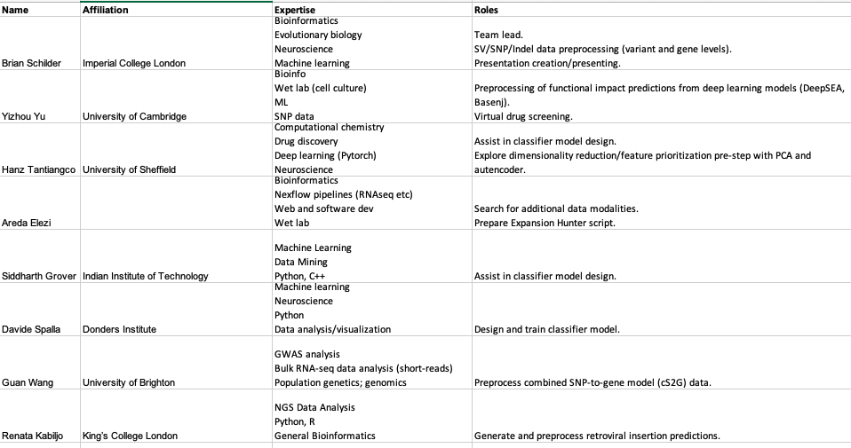
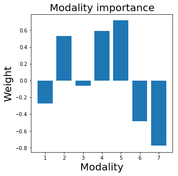
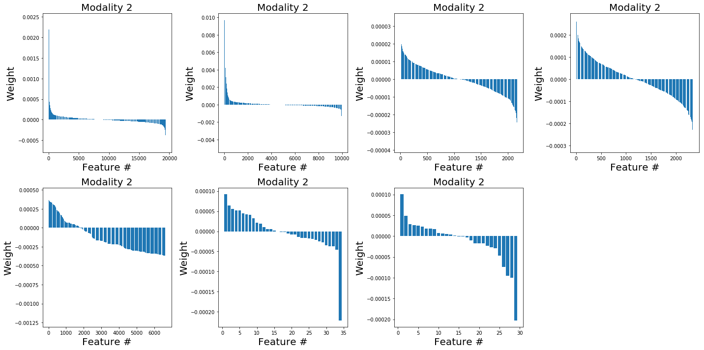
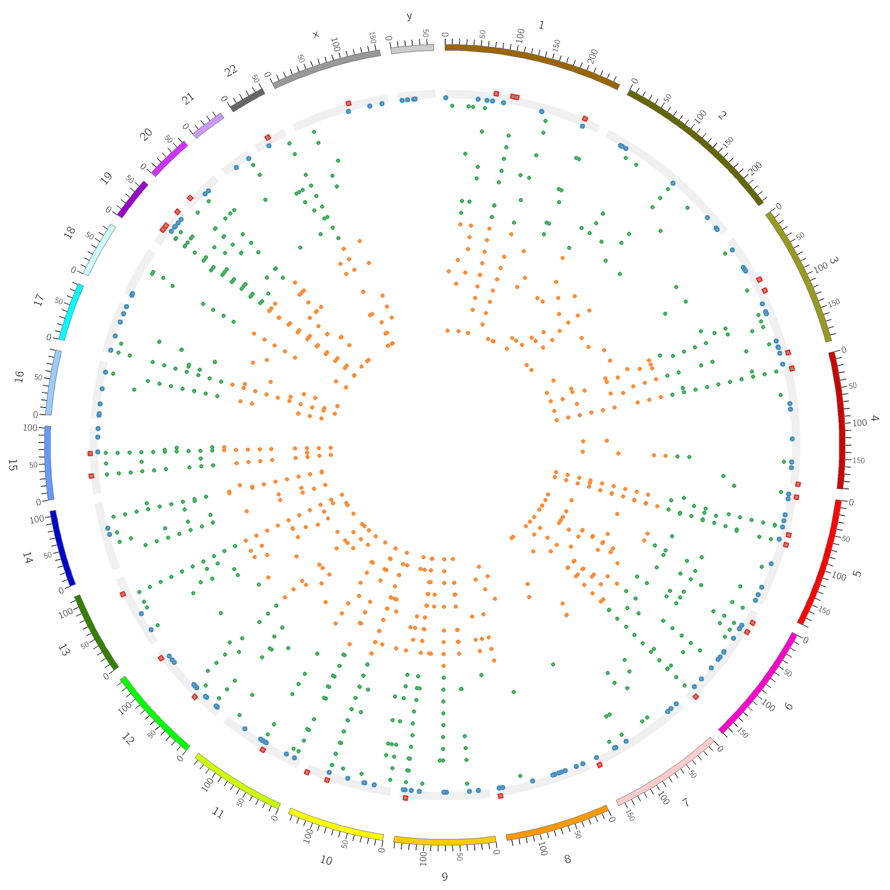
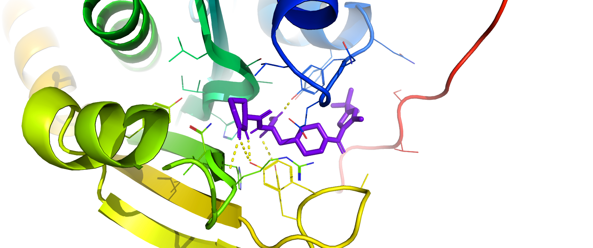
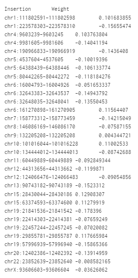

## Team 

 

### Members  



### Project title 

Predicting ALS drug targets using integrative multi-modal machine learning 

### Goals   

1. Identify molecular targets (genes and variants) of ALS (status and survival time).  
2. Identify potential therapeutics for ALS.  

### Workflow

1. Preprocess input datasets  
    + MND_ALS VCFs  
    + Predict HERV-K insertions from whole genome sequencing data (BAM files)
	+ External datasets  
2. Filter input features  
3. Train predictive model  
4. Extract key genes
5. Identify therapeutics

## Abstract  


Amyotrophic lateral sclerosis is a fatal neurodegenerative disease characterised by progressive paralysis. Curative and palliative treatments are however lacking. 
Here, we combine multiple modalities including functional annotations, retroviral insertions, SNP, Indels, structural variants, and trained a machine learning model. 
Through this deep neural network, we identified several gene targets. We then analysed these gene targets and identified a few drugs targets that could be then validated using in vivo models.

## Introduction 

### ALS

Amyotrophic lateral sclerosis (ALS), also known as Motor Neuron Disease (MND), is a progressive neurodegenerative disease. ASL onsets in individuals between 55 and 70 years old, with a predominance in the male population and a mean survival rate of 3 to 5 years [1]. 
ALS affects the upper and lower motor neurons and it is clinically identified by weakness in spinal and bulbar muscles with atrophy, spasticity, weight loss and ultimately respiratory failure [2]. Although it is not usually inherited from the parents, 30 genes have been linked to the presence of the disease, with the GGGGCC repeat expansion of the _C9orf72_ gene being present in 40% of  European-ancestry patients [1]. Current approaches for the treatment of ALS have relied on prescription of drugs that target cellular pathways that are responsible for neurodegeneration. 

The complexity of amyotrophic lateral sclerosis (ALS) poses immense challenges on precisely capturing the underlying disease architecture. A most recent genomic research identified 15 risk loci in predisposition to ALS in 29,612 ALS patients (GWAS) combined with rich WGS data from 6,538 patients (van Rheenen et al. Nat. Genet. 2021). Genomics is largely a data-driven research. Recent developments in machine learning approaches highlight their flexibility in generating new biological hypotheses, compared to handcrafted methods. Here, we propose to identify potential therapeutic targets for ALS using an integrative multi-modal machine learning approach to not only identify molecular targets indicative of ALS status and survival time but also to create a model that can be easily adapted and implemented for other neurodegenerative diseases and beyond.
 
### Background on HERV-K retroviral insertions

There is increasingly strong evidence that human endogenous retroviruses play a role in the development of motor neuron disease (ALS). Both human and mouse retroviruses can cause ALS-like syndromes. Furthermore, people with ALS have been shown to have antibodies against retroviral proteins in their blood. Most HERVs lack function due to accumulated mutations or recombination, but the most recently acquired, HERV-K appears tens of times in the genome, and in several cases is nearly or completely intact, with genes that can be expressed as functional proteins. The location of sequences like HERV-K in the genome is variable, with the potential to disrupt genes, and the degree to which the sequences can be transcribed into protein also varies, determined by the integrity of each sequence, expression loci, and methylation marks. The genetic landscape of HERV-K insertions and how they vary between individuals is not known. An initial attempt to discover and characterize HERV insertions has been made using low genomic coverage data from the 1000 Genomes Project.

### Classifier model 

The classifier model is an instance of a deep neural network for binary classification of survival status (SHORT vs LONG) from any number of features coming from different data modalities.

The main idea is to have a model able to handle data from different data streams, and integrate them to make prediction about phenotypic outcomes. 
The architecture is design for extreme flexibility, making it straightforward to feed any number of different data streams to the model.
Model complexity is kept to a minimum to ensure interpretability and good functioning in the low sampling regime, but can easily be extended to enhance the representational power of the model.

## Materials  

The following datatypes were prepared as numeric 
participant x feature matrices that could be fed into our machine learning model.

### Phenotypes 

Participant x phenotype data for each of the 20 ALS participants were encoded as numeric vectors and fed as input to the model. This currently only include sex, but can easily be expanded to other categorical or continuous traits as they become available. 

### [Functional annotations](https://github.com/DEMON-NEUROHACK/Challenge-3-London-Team-C/blob/main/data/snp_geno_matrix_h3k4me3_inputForML.tsv)

Deep learning models have shown great promise in predicting regulatory effects from single nucleotide polymorphisms. In this part, we used a deep learning model called Basenji, created by [Kelley et al.](https://pubmed.ncbi.nlm.nih.gov/29588361/) to predict the regulatory activity of the genes based on methylation status of histone 3 lysine 4 (H3K4M3). [Del et al.](https://www.nature.com/articles/s41467-020-18515-4) have shown that H3K4M3 status are significantly informative for diseases. We therefore hypothesise that including this information as a modality in our machine learning model will enhance its accuracy. The code developed for this part is [here](https://github.com/DEMON-NEUROHACK/Challenge-3-London-Team-C/blob/main/code/functional_annotations_H3K4ME3_allTissues.Rmd)


### [Retroviral insertions](https://github.com/DEMON-NEUROHACK/Challenge-3-London-Team-C/tree/main/data/HERVK_Insertions)  

Retroviral insertions were identified using the pipeline described [here](https://github.com/DEMON-NEUROHACK/Challenge-3-London-Team-C/blob/main/data/HERVK_Insertions/readme.md).  The matrix with predicted insertions is then used as one of the inputs to the classifier

### Genoytpe Encodings

**Table 1**: Genotype encodings. 

```{r}
data.table::fread("data/genotype_encodings.csv")
```

### [SNPs: variant-level](https://github.com/DEMON-NEUROHACK/Challenge-3-London-Team-C/tree/main/data/SNP_VCFs/by_variant) 

For each individual, genotypes from both alleles were encoded as integer values at every SNP position (**Table 1**), following standards set by the [`snpMatrix` data class in R](https://rdrr.io/bioc/VariantAnnotation/man/genotypeToSnpMatrix-methods.html). These encodings were then merged across individuals and cast into a participant x variant matrix. 

All code for preparing variant- and gene-level matrices (for SNPs, cS2G, SVs , and Indel datatypes) can be found [here](https://github.com/DEMON-NEUROHACK/Challenge-3-London-Team-C/blob/main/code/query_VCF.Rmd). 

### [SNPs: gene-level](https://github.com/DEMON-NEUROHACK/Challenge-3-London-Team-C/tree/main/data/SNP_VCFs/by_gene) 

Data generated in the prior variant-level step were then aggregated to generate a gene-level dataset After numerically encoding all genotypes, SNPs were mapped to genes using overlap/proximity-based annotations already included in the VCF files. Genotype encoding were then averaged to produce gene level encodings. Finally, we generated gene-level scores for each participant by estimating the encoded genotype residuals, applying z-score normalisation, and then rescaling all values from 0-1:, Residuals were computed using the following formula: 
 
 - *GT_int*: Gene-level average of numerically encoded genotypes. 
 - *count*: The number of time each gene is counted in the VCF annotations. 
 - *SVLEN*: The length of the SV. 
 - *TXLENGTH*: Gene length, computed by taking the mean length of all of each gene's trancripts. 
 - *QUAL*: Genotype quality score, produced during imputation.  
 
`GT_int ~ count + SVLEN + TXLENGTH + QUAL` 

### [cS2G: gene-level](https://github.com/DEMON-NEUROHACK/Challenge-3-London-Team-C/tree/main/data/cS2G/by_gene)

Unlike the aforementioned gene-level scores derived from SNPs, these SNP-to-gene mappings were made using scores generated by the combined SNPs-to-genes (cS2G) model [(Gazal et al., bioRxiv, 2021)](https://doi.org/10.1101/2021.08.02.21261488). cS2G integrates data from various sources (e.g. QTLs, chromatin interactions) to create 
more accurate SNP-to-gene mappings. We specifically used the predictions generated for all SNP positions in the UK Biobank (found [here](https://alkesgroup.broadinstitute.org/cS2G/cS2G_UKBB/)). 

We incorporated cS2G predictions to generate gene-level scores as follows:  

*cS2G*: The cS2G-predicted probability of a SNP-to-gene interactions, averaged by gene. 

`GT_int ~ cS2G`  

As before, the residuals were normalised and rescaled to generate gene-level scores for each participant.

### [Indels: variant-level](https://github.com/DEMON-NEUROHACK/Challenge-3-London-Team-C/tree/main/data/Indel_VCFs/by_variant)  

Similar to the SNP variants, insertions and deletions (indels) were numerically encoded and cast into a participant x variant matrix.  

### [SVs: variant-level](https://github.com/DEMON-NEUROHACK/Challenge-3-London-Team-C/tree/main/data/SV_VCFs/by_variant)   

Structural variant (SV) genotypes were numerically encoded and then split into four SV types: deletions (DEL), insertions (INS), duplications/tandem repeats (DUP:TANDEM), and inversions (INV). Each of these SV types were cast into their own separate participant x variant matrices. 

### [SVs: gene-level](https://github.com/DEMON-NEUROHACK/Challenge-3-London-Team-C/tree/main/data/SV_VCFs/by_gene)  

Using the same strategy as the SNP gene-level matrices, gene-level scores were computed for each SV type, producing a series of participant x gene matrices.
   

## Methods  

### Dimensionality reduction model 

Prior to training the classifier model, dimensionality reduction and feature selection were performed on the training datasets. The purpose of this initial step is to optimise model training by only selecting the top features from the dataset. In this project, we compared PCA and autoencoders for dimensionality reduction and feature selection.

Prior to training the classifier model, dimensionality reduction and feature selection were performed on the training datasets. The purpose of this initial step is to optimise model training by only selecting the top features from the dataset. In this project, we compared PCA and autoencoders for dimensionality reduction and feature selection.

The code used to run PCA can be found [here](https://github.com/DEMON-NEUROHACK/Challenge-3-London-Team-C/blob/main/code/PCA.ipynb).  
The code used to create and train the autoencoder can be found [here](https://github.com/DEMON-NEUROHACK/Challenge-3-London-Team-C/blob/main/code/autoencoder_hanz.ipynb). 

**Figure 1.**: Dimensionality reduction model architecture.


### Classifier model 

Each input modality (datatype) was fed into an supervised fully-connected artificial neural network (ANN), such that each participant is a sample and each gene/variant/annotation is a feature. The inputs of the model are initially partitioned into separate "channels" of the model input, and are reduced in dimensionality by the subsequent layers. Next, the reduced representation from each modality are concatenated into a single vector (layer 3 in **Fig. 2** below). Finally, the data is further compressed to predict which phenotypic category each participant belongs to. 

**Figure 2**: Classifier model architecture. 

 

The model is currently designed to provide categorical predictions for each sample: short-survival vs. long-survival, or ALS vs. control (depending on the data available). However, it can also easily be adapted to continuous phenotypic data (e.g. survival years, GWAS-derived polygenic risk score (PRS)). 

Once fully trained, the model can be interrogated to extract the most relevant features per modality. This allows us to generate ranked lists of genes/variants/annotations which can be used in the candidate therapeutics  prediction step. 

The model outputs consists of. 
1 - a modality weigth, informing about the magnitude and the direction fo the contribution of each modality to the prediction perfromance:  
. 

2 - a contribution score for each feature in each modality, that can be used to rank feature within modality:  
. 


All code used to create, train and evaluate the classifier model can be found [here](https://github.com/DEMON-NEUROHACK/Challenge-3-London-Team-C/blob/main/code/multimodal_classifier.ipynb).


### Therapeutics prediction 
 
Once the relative importance of each gene for predicting ALS survival have been identified, three complementary approaches will be used to identify candidate 
therapeutics for ALS: 1. virtual screening, 2. perturbation database queries, 3. literature mining. 

#### Molecular modelling / virtual screening
The top protein-coding gene target was selected. The inhibitor was predicted using [ChEMBL](https://pubmed.ncbi.nlm.nih.gov/32117874/). 
The structure of the protein was generated using [AlphaFold2](https://pubmed.ncbi.nlm.nih.gov/34293799/) and the docking was performed using [Autodock Vina](https://pubmed.ncbi.nlm.nih.gov/19499576/).


#### Perturbation database queries 

#### Literature mining  


 
## Results 

### Retroviral Insertions HERV-K

**Figure**: HERV-K prediction software has been ran on 20 whole genome sequences.



Circular Chromosomal Plot with predicred HERV-K Insertions

Legend: the outer circle represents known HERV-K insertions; blue dots if they are in the reference genome and red if they are not

Circles with orange dots: subjects with long survival time

Circles with green dots: subjects with short survival time

*As the facilitators executed the HERV-K prediction tools for us, they were not able to give us these individual level results. The plot is an example plot used on deidentified subjects whose whole genome sequences we had access to


### Molecular modelling / virtual screening

One of the top gene targets we identified was N-alpha-acetyltransferase 10 or [NAA10](https://www.uniprot.org/uniprot/P41227).
Therefore, we sought to identify drugs that could interact with this protein.
We used ChEMBL to find a potential drug that might interact with NAA10,
and identified a new compound [CHEMBL4635926](https://www.ebi.ac.uk/chembl/g/#browse/compounds/filter/_metadata.related_targets.all_chembl_ids%3ACHEMBL4630819).
Since this has not been validated, we used molecular docking simulations.
We first used AlphaFold2 to generate a crystal sturcture of NAA10: [figure](https://github.com/DEMON-NEUROHACK/Challenge-3-London-Team-C/blob/main/figures/docking/AF2_NAA10_prediction.png). 
We then docked the compound we identified previously (CHEMBL4635926) onto this predicted structure: [figure](https://github.com/DEMON-NEUROHACK/Challenge-3-London-Team-C/blob/main/figures/docking/docking_output.png). 
This lead to a docking energy of -9.2 kcal/mol, indicating that the CHEMBL4635926 binds strongly to NAA10.
These results indicate that the efficiency of CHEMBL4635926 to treat ALS could be tested in animal models.

 
**Binding conformation of CHEMBL4635926 on N-alpha-acetyltransferase 10** The chains of the proteins are coloured differently and the target drug CHEMBL4635926 is in purple at the centre of the image.


### Dimensionality Reduction and Ranking




## Conclusions  

1.  
2. 
3.  

## Future directions  

1.  Estimate the size of repeats within a genome using Expansion Hunter by searching through a BAM/CRAM file for reads that span, flank, and are fully contained in each repeat.
2.  Improve the model to incorporate further modalities and ensure it is transformative to tackle other complex diseases and traits. 
 

<hr> 

## References 

> 1. Marisa Cappella, Pierre-François Pradat, Giorgia Querin, Maria Biferi. Beyond the Traditional Clinical Trials for Amyotrophic Lateral Sclerosis and The Future Impact of Gene Therapy. Journal of Neuromuscular Diseases, IOS Press, 2021, 8 (1), pp.25 - 38. ff10.3233/jnd-200531ff. ffhal-03346426  
> 2. Miller RG, Mitchell JD, Moore DH. Riluzole for amyotrophic lateral sclerosis (ALS)/motor neuron disease (MND). Cochrane Database of Systematic Reviews 2012, Issue 3. Art. No.: CD001447. DOI: 10.1002/14651858.CD001447.pub3.  
> 3. van Rheenen, W., van der Spek, R.A.A., Bakker, M.K. et al. Common and rare variant association analyses in amyotrophic lateral sclerosis identify 15 risk loci with distinct genetic architectures and neuron-specific biology. Nat Genet 53, 1636–1648 (2021). [https://doi.org/10.1038/s41588-021-00973-1](https://doi.org/10.1038/s41588-021-00973-1) 


<hr> 

## Session info

<details>

```{r}
utils::sessionInfo()
```

</details>
<br> 
