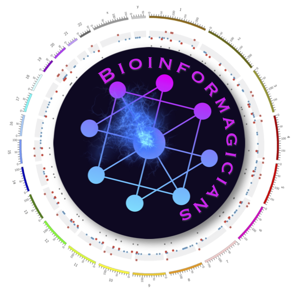

## Team 

 

### Members  

```{r}
members <- readxl::read_excel("presentations/team_members.xlsx")
data.frame(members)
```

### Project title 

Predicting ALS drug targets using integrative multi-modal machine learning 

### Goals   

1. Identify molecular targets (genes and variants) of ALS (status and survival time).  
2. Identify potential therapeutics for ALS.  

### Workflow

1. Preprocess input datasets  
    + MND_ALS VCFs  
	+ External datasets  
2. Filter input features  
3. Train predictive model  
4. Extract key genes
5. Identify therapeutics

## Abstract  

[ALS background info] 
[our approach] 
[main findings] 
[future directions]

## Materials  

The following datatypes were prepared as numeric 
participant x feature matrices that could be fed into our machine learning model.


### Phenotypes 

Participant x phenotype data for each of the 20 ALS participants were encoded as numeric vectors and fed as input to the model. This currently only include sex, but can easily be expanded to other categorical or continuous traits as they become available. 


### [Retroviral insertions](https://github.com/DEMON-NEUROHACK/Challenge-3-London-Team-C/tree/main/data/HERVK_Insertions)  

Retroviral insertions were identified using the pipeline described [here](https://github.com/DEMON-NEUROHACK/Challenge-3-London-Team-C/blob/main/data/HERVK_Insertions/readme.md). 

**Table 1**: Genotype encodings. 

```{r}
data.table::fread("data/genotype_encodings.csv")
```

### [SNPs: variant-level](https://github.com/DEMON-NEUROHACK/Challenge-3-London-Team-C/tree/main/data/SNP_VCFs/by_variant) 

For each individual, genotypes from both alleles were encoded as integer values at every SNP position (**Table 1**), following standards set by the [`snpMatrix` data class in R](https://rdrr.io/bioc/VariantAnnotation/man/genotypeToSnpMatrix-methods.html). These encodings were then merged across individuals and cast into a participant x variant matrix. 

All code for preparing variant- and gene-level matrices (for SNPs, cS2G, SVs , and Indel datatypes) can be found [here](https://github.com/DEMON-NEUROHACK/Challenge-3-London-Team-C/blob/main/code/query_VCF.Rmd). 

### [SNPs: gene-level](https://github.com/DEMON-NEUROHACK/Challenge-3-London-Team-C/tree/main/data/SNP_VCFs/by_gene) 

Data generated in the prior variant-level step were then aggregated to generate a gene-level dataset After numerically encoding all genotypes, SNPs were mapped to genes using overlap/proximity-based annotations already included in the VCF files. Genotype encoding were then averaged to produce gene level encodings. Finally, we generated gene-level scores for each participant by estimating the encoded genotype residuals, applying z-score normalisation, and then rescaling all values from 0-1:, Residuals were computed using the following formula: 
 
 - *GT_int*: Gene-level average of numerically encoded genotypes. 
 - *count*: The number of time each gene is counted in the VCF annotations. 
 - *SVLEN*: The length of the SV. 
 - *TXLENGTH*: Gene length, computed by taking the mean length of all of each gene's trancripts. 
 - *QUAL*: Genotype quality score, produced during imputation.  
 
`GT_int ~ count + SVLEN + TXLENGTH + QUAL` 

### [cS2G: gene-level](https://github.com/DEMON-NEUROHACK/Challenge-3-London-Team-C/tree/main/data/cS2G/by_gene)

Unlike the aforementioned gene-level scores derived from SNPs, these SNP-to-gene mappings were made using scores generated by the combined SNPs-to-genes (cS2G) model [(Gazal et al., bioRxiv, 2021)](https://doi.org/10.1101/2021.08.02.21261488). cS2G integrates data from various sources (e.g. QTLs, chromatin interactions) to create 
more accurate SNP-to-gene mappings. We specifically used the predictions generated for all SNP positions in the UK Biobank (found [here](https://alkesgroup.broadinstitute.org/cS2G/cS2G_UKBB/)). 

We incorporated cS2G predictions to generate gene-level scores as follows:  

*cS2G*: The cS2G-predicted probability of a SNP-to-gene interactions, averaged by gene. 

`GT_int ~ cS2G`  

As before, the residuals were normalised and rescaled to generate gene-level scores for each participant.

### [Indels: variant-level](https://github.com/DEMON-NEUROHACK/Challenge-3-London-Team-C/tree/main/data/Indel_VCFs/by_variant)  

Similar to the SNP variants, insertions and deletions (indels) were numerically encoded and cast into a participant x variant matrix.  

### [SVs: variant-level](https://github.com/DEMON-NEUROHACK/Challenge-3-London-Team-C/tree/main/data/SV_VCFs/by_variant)   

Structural variant (SV) genotypes were numerically encoded and then split into four SV types: deletions (DEL), insertions (INS), duplications/tandem repeats (DUP:TANDEM), and inversions (INV). Each of these SV types were cast into their own separate participant x variant matrices. 

### [SVs: gene-level](https://github.com/DEMON-NEUROHACK/Challenge-3-London-Team-C/tree/main/data/SV_VCFs/by_gene)  

Using the same strategy as the SNP gene-level matrices, gene-level scores were computed for each SV type, producing a series of participant x gene matrices.
   

## Methods  

### Dimensionality reduction model 

[PCA/autoencoder description here by @Hanz]

The code used to run PCA can be found [here](https://github.com/DEMON-NEUROHACK/Challenge-3-London-Team-C/blob/main/code/PCA.ipynb).  
The code used to create and train the autoencoder can be found [here](https://github.com/DEMON-NEUROHACK/Challenge-3-London-Team-C/blob/main/code/autoencoder.ipynb). 

**Figure 1.**: Dimensionality reduction model architecture.


### Classifier model 

Each input modality (datatype) was fed into an supervised fully-connected artificial neural network (ANN), such that each participant is a sample and each gene/variant/annotation is a feature. The inputs of the model are initially partitioned into separate "channels" of the model input, and are reduced in dimensionality by the subsequent layers. Next, the reduced representation from each modality are concatenated into a single vector (layer 3 in **Fig. 2** below). Finally, the data is further compressed to predict which phenotypic category each participant belongs to. 

The model is currently designed to provide categorical predictions for each sample: short-survival vs. long-survival, or ALS vs. control (depending on the data available). However, it can also easily be adapted to continuous phenotypic data (e.g. survival years, GWAS-derived polygenic risk score (PRS)). 

Once fully trained, the model can be interrogated to extract the most relevant features per modality. This allows us to generate ranked lists of genes/variants/annotations which can be used in the candidate therapeutics  prediction step. 

All code used to create, train and evaluate the classifier model can be found [here](https://github.com/DEMON-NEUROHACK/Challenge-3-London-Team-C/blob/main/code/multimodal_classifier.ipynb).

**Figure 2**: Classifier model architecture. 

 

### Therapeutics prediction 
 
Once the relative importance of each gene for predicting ALS survival have been identified, three complementary approaches will be used to identify candidate 
therapeutics for ALS: 1. virtual screening, 2. perturbation database queries, 3. literature mining. 

#### Virtual screening

[description by @Yizhou here]

#### Perturbation database queries 

#### Literature mining  


 
## Results 


## Conclusions  

1.  
2. 
3.  

## Future directions 

1.  
2. 
3.  
 

<hr> 

## References 

> van Rheenen, W., van der Spek, R.A.A., Bakker, M.K. et al. Common and rare variant association analyses in amyotrophic lateral sclerosis identify 15 risk loci with distinct genetic architectures and neuron-specific biology. Nat Genet 53, 1636–1648 (2021). [https://doi.org/10.1038/s41588-021-00973-1](https://doi.org/10.1038/s41588-021-00973-1) 


<hr> 

## Session info

<details>

```{r}
utils::sessionInfo()
```

</details>
<br> 